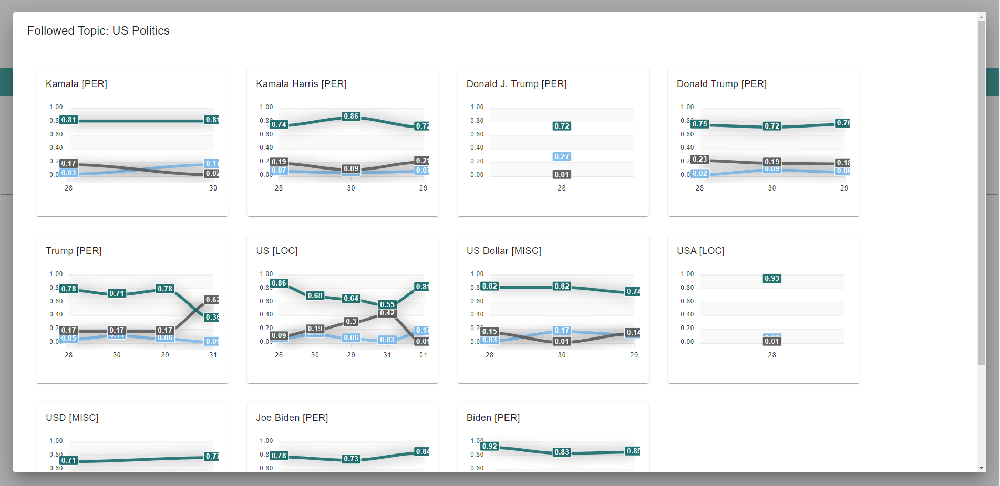
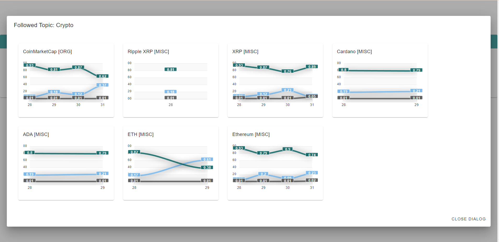

# DEPRECATED SEE https://github.com/just-rene/INSPECT-IA-PUBLIC

# INSPECT 
INSPECT is a sentiment and NER extraction tool!

## New Features 4.0:
Kubernetes load balanced microservices

## Features

#### STOCK SENTIMENT CORRELATION (NEW)
computes correlation between sentiment and stock data

#### EMOTION FILTER
filter article by emotions

#### SENTIMENT BY DAY
track the overall sentiment by day

#### NER
extract important locations, persons, organisations and misc 

#### FOLLOW TOPIC
cluster multiple topics to one umbrella term and track the sentiment over time

## Setup

## Authentication Ingress
Here are all steps for creating a authentication for ingress, if required:
https://kubernetes.github.io/ingress-nginx/examples/auth/basic/

## StatefulSet MongoDB
Here are all steps for creating a StatefulSet with mongoDB, if required:
https://www.mongodb.com/developer/products/mongodb/mongodb-with-kubernetes/

#### APIs: 
Huggingface account (API-key), [Huggingface](https://huggingface.co/)   
polygon account (API-key)  [Polygon](https://polygon.io/)    

### remarks
1) all webscrapper have been removed for legal reasons 
1) inputs are not validated

